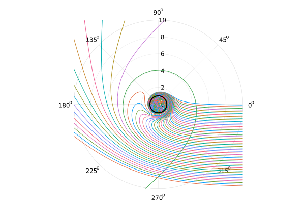
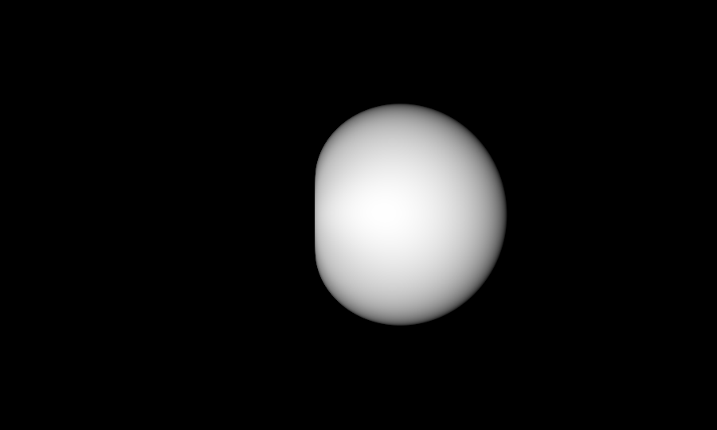
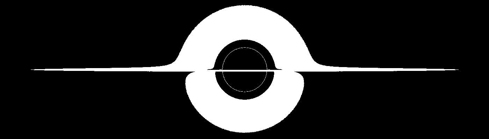
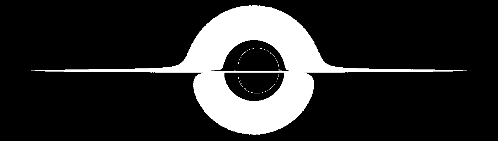
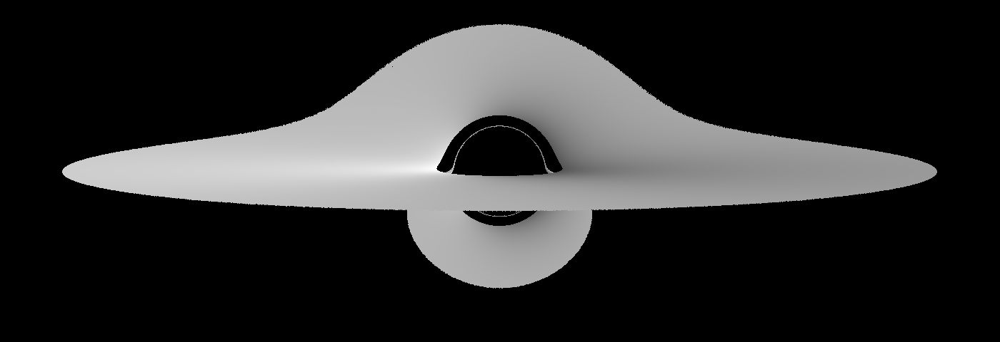
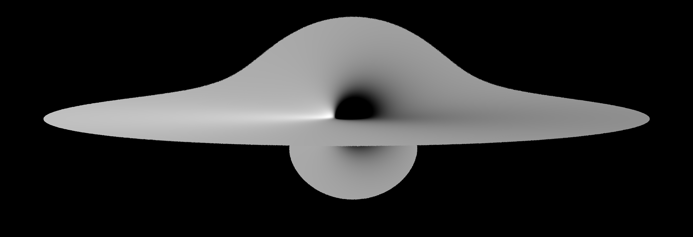

# Package overview

This package can be used to create renderings of different spacetimes. Currently, there is a bias towards spacetimes with a singularity at the origin, but as the package develops, this bias will be phased out.

## Geodesic paths

```julia
using GeodesicTracer
using Plots
gr()

s = BHSetup(
    metric=CarterBoyerLindquist(M=1.0, a=1.0)
)

test_plot = plot(
    proj = :polar, # polar projection
)

β = 0.01
simsol = @time calcgeodesic((0.01, 10.0), 50, β, s)

plot!(test_plot, simsol, vars = (4, 2))
plot!(
    test_plot,
    _ -> GeodesicTracer.R₀(s),
    0:0.01:2π,
    line = (:solid, 2),
    color=:black,
    range=(0.0, 10.0)
)
test_plot
```



## Shadow of a black hole

```julia
using GeodesicTracer

s = BHSetup(
    metric=CarterBoyerLindquist(M=1.0, a=1.0)
)

rescale!(s, 3) # make image larger
s.fov_factor *= 3 # zoom

time = ValueFunction(
    (val, λ, u, p, d) -> λ
)

img = @time render(s, valuefunc=time)

# image processing, centering the colour range around 990.0

img_temp = @. abs(img - 2000.0) - 990.0
img_temp = map(i -> (i > 0.0) * i, img_temp)
```



## Geometry of an accretion disk

```julia
using GeodesicTracer

s = BHSetup(
    metric=CarterBoyerLindquist(M=1.0, a=0.0),
    θ₀=deg2rad(89.5),
    img_width=350,
    img_height=100
)

rescale!(s, 4)

d = GeometricDisk(
    r_inner = 8.0 # so we can see separation of disk and horizon
)

println("Rendering...")
img = @time render(d, s, valuefunc=GeodesicTracer.geometry)
```

Non-spinning `a=0.0`:



Spinning `a=1.0`:



## Redshift of an accretion disk

This is currently only available for the [`CarterBoyerLindquist`](@ref) coordinates.

```julia
using GeodesicTracer

s = BHSetup(
    metric=CarterBoyerLindquist(M=1.0, a=1.0),
    θ₀=deg2rad(85.0),
    img_width=350,
    img_height=120
)

rescale!(s, 8)

d = GeometricDisk(
    r_inner = GeodesicTracer.rms(s)
)

println("Rendering...")
img = @time render(d, s, valuefunc=GeodesicTracer.redshift)
```

Non-spinning `a=0.0`:



Spinning `a=1.0`:



