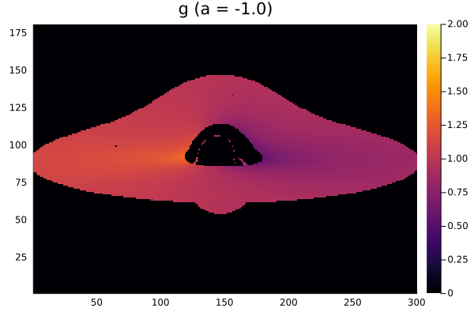

# Redshift calculations

```@meta
CurrentModule = GeodesicTracer
```

## Gallery



## Redshift calculations

```@docs
redshift
```

All of the following methods use the macro [`@vec_eq`](@ref).

The redshift is calculated differently depending on whether the photon is emitted from the *plunging region*, at $r < r_{\text{ms}}$, or from a regular Keplerian orbiting region of the accretion disk.

For the first case of the plunging region we define:

```@docs
plg_pdotu_inv
```

The for Keplerian regions of the disk, we define:

```@docs
reg_pdotu_inv
```

### Coordinate functions

```@docs
eⱽ
eᶲ
ω
Ωₑ
Vₑ
Lₑ
H
γₑ
uʳ
uᶲ
uᵗ
```