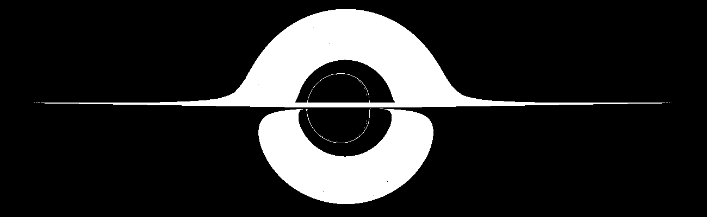
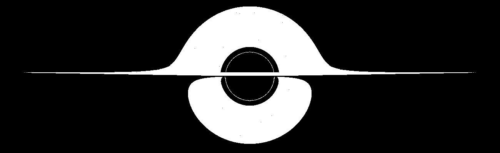

# Rendering method

## Gallery

A maximally spinning geometric disk render:



A non spinning geometric disk render:




At the moment, using `--threads=4`, takes approximately 80 seconds to render on typhon, but there are many inefficiencies to be ironed out later:

- currently each geodesic ends up being traced twice; once by the integrator, once by the intersection calculator. This was done in the anticipation of using the GPU for the rendering part, which would require "uploading" the geodesic arrays into the GPU device for access. On the CPU, this could be similarly streamlined, either by using an array value cache, allowing integrated geodesics to be reused, or by assimilating the intersection code (optionally, maybe with macros?) into the integration.

- many values are calculated twice (especially coordinate functions), since it was easier to read -- it would be fairly trivial to collapse the function calls into a properly value-cached alternative, but there is currently a reluctance to do so in favour of keeping the code legible. 

## Methods

Currently, there are no methods for creating images like the above, as the rendering process is hard coded to calculate red shifts.

This is only temporary, and will be changed for arbitrary targets in the future.

The rendering routines are invoked via:

```@docs
renderdisk
renderdisk!
```

These functions are wrappers around the row based ensemble geodesic tracing function:

```@docs
GeodesicTracer.render!
```

## Disks

All disks derive from the `AccretionDisk` abstract type.

### Geometric
```@docs
GeometricDisk
GeodesicTracer.intersect!
```